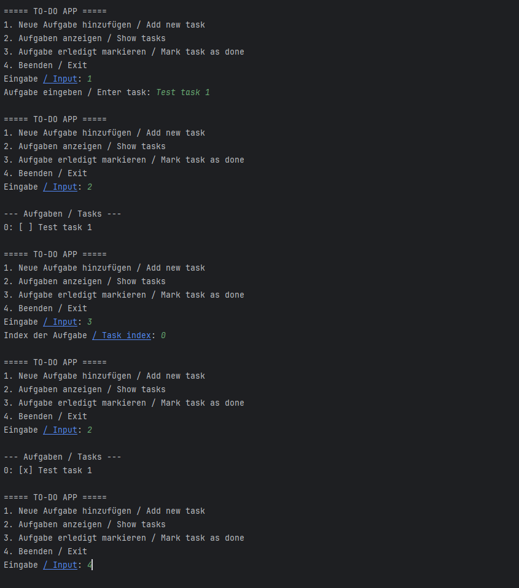

<<<<<<< HEAD
# 📝 Java ToDo App with CSV Storage

A simple **ToDo application** written in **Java** that stores tasks in a CSV file.  
This project was created to practice **Object-Oriented Programming (OOP)** and basic **file handling** in Java.

---

## 🚀 Features
- Add new tasks
- Show all tasks
- Mark tasks as done
- Save tasks to a CSV file (`tasks.csv`)
- Load tasks automatically when the program starts

---

## 🛠 Project Structure
- src
  - app
    - Main
  - model
    - Task
  - service
    - CSVHandler
    - TaskManager
- Readme
---

---

## ▶️ How to Run
1. Install **Java JDK 17+**  
   [Download JDK](https://adoptium.net/)

2. Clone this repository:
   ```bash
   git clone https://github.com/Akbari786/TodoApp.git
   cd TodoApp
   ==== ToDo App ====
1. Show tasks
2. Add task
3. Mark task as done
4. Save and Exit
   Choose option: 2
   Enter task description: Buy groceries

==== ToDo App ====
1. Show tasks
2. Add task
3. Mark task as done
4. Save and Exit
   Choose option: 1
1. [ ] Buy groceries
## Beispiel-Ausgabe / Sample Output



=======
# TodoApp
Simple Java ToDo App with CSV storage
>>>>>>> e79df3bbc296da40078a14e98c3f65471e3854cf
